# Print Labels

How to select specimens, configure page layout, design label templates, and print.

Open **Print labels** from the project menu (side drawer).

---

## Print Labels Screen

This is the main screen. Select specimens from the table, configure how labels tile onto a sheet, then print.

**Figure 1** — Print labels screen

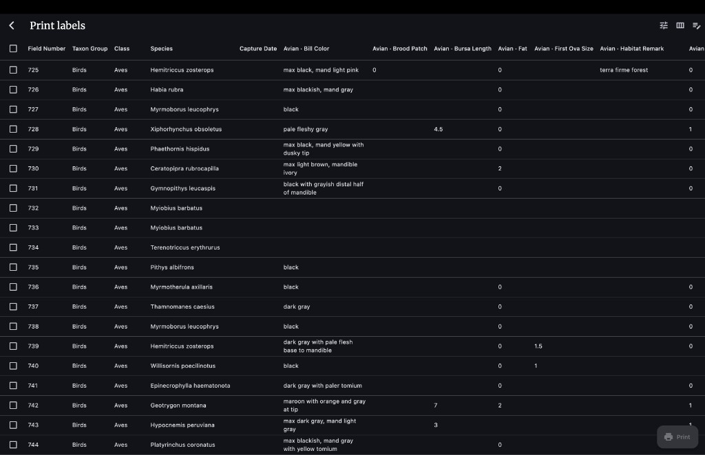

The table lists all specimens in the project. Each row has a **checkbox** on the left to select it for printing. Columns show field data (Field Number, Taxon Group, Class, Species, and avian-specific fields like Bill Color, Fat, etc.). The table scrolls horizontally when there are many columns. A header checkbox selects or deselects all rows at once. The **Print** button sits in the bottom-right corner. Three action icons sit in the top-right app bar (see App Bar Buttons below).

### App Bar Buttons

Three buttons in the top-right corner of the app bar (visible in Figure 1):

| Button | What it does |
|--------|-------------|
| **Sliders icon** | Toggles the **Print layout** panel on or off (see Figure 2). |
| **Column icon** | Opens the **Table columns** dialog (see Figure 3). |
| **Notepad icon** | Opens the **Label Editor** (see Figure 4). |

### Print Layout Panel

Tap the **sliders icon** to reveal this panel above the table.

**Figure 2** — Print layout panel

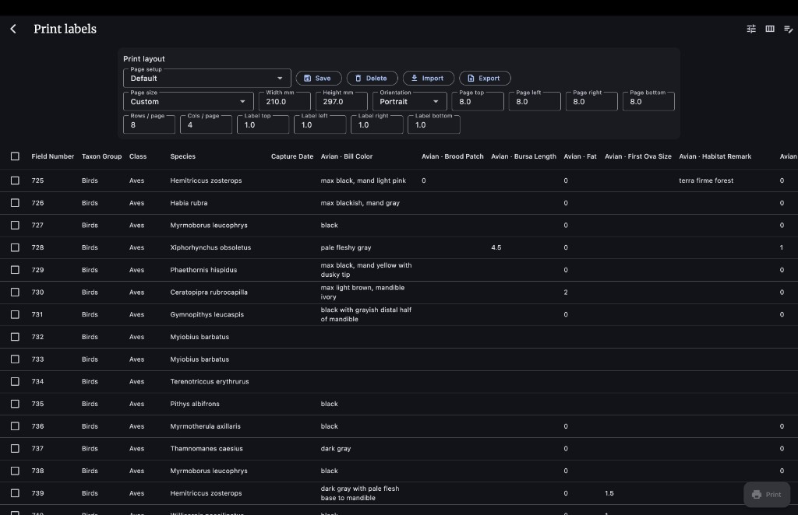

The **Print layout** card sits above the specimen table. It contains dropdowns and number fields that control how labels are arranged on paper. The **Page setup** dropdown at top-left selects a saved configuration. Buttons next to it: **Save**, **Delete**, **Import**, **Export**. Below: **Page size**, **Width/Height** (when Custom), **Orientation**, margin fields, and label grid settings.

**Page setup** — A dropdown of saved page setups. Pick one to load all its settings. Next to it:

- **Save** — Save current settings under a name.
- **Delete** — Remove the selected setup (cannot delete **Default**).
- **Import** — Load a page setup from a JSON file.
- **Export** — Save current setup to a JSON file.

**Page settings:**

- **Page size** — A4, Letter, Custom, etc. Choosing **Custom** reveals **Width mm** and **Height mm** fields.
- **Orientation** — Portrait or Landscape.
- **Page top / left / right / bottom** — Outer margins of the sheet (mm).

**Label grid:**

- **Rows / page** — How many label rows per sheet.
- **Cols / page** — How many label columns per sheet.
- **Label top / left / right / bottom** — Padding around each label cell (mm).

These values are used when generating the PDF.

### Table Columns Dialog

Tap the **column icon** in the app bar (Figure 1) to open this dialog.

**Figure 3** — Table columns dialog

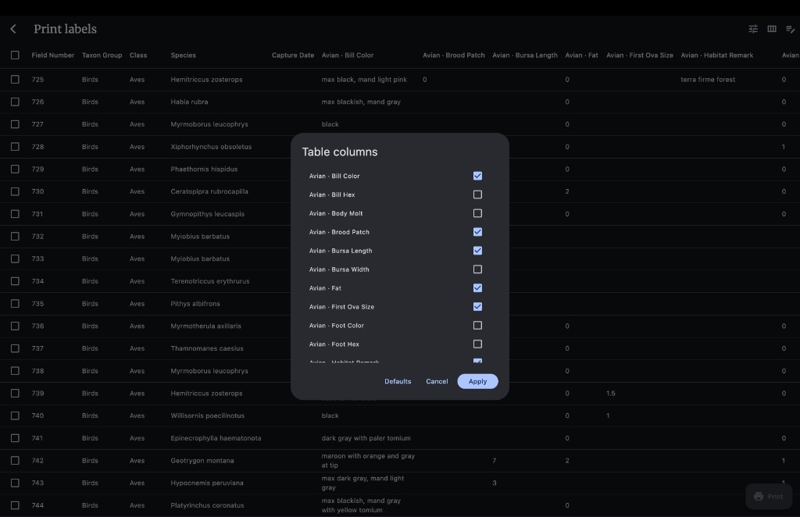

The dialog overlays the table and lists every available data field with a checkbox. Checked fields appear as columns in the table. Three buttons at the bottom: **Defaults**, **Cancel**, **Apply**.

This **only** controls which columns you see in the table — it does **not** change what prints on labels. Label content comes from the **Label Editor** template.

- **Defaults** — Reset to the default column set.
- **Cancel** — Close without changes.
- **Apply** — Save your selection and refresh the table.

### Print Button

The **Print** floating button (bottom-right of Figure 1, printer icon) generates a PDF from the selected specimens using the current **Print layout** settings and the active label template. It opens a PDF preview screen.

The button is disabled until you select at least one specimen.

### PDF Preview Screen

After tapping **Print**, a full-screen PDF preview opens. If saved templates exist, a **Template** menu in the app bar lets you switch which template is used for this PDF (a check mark shows the active one). You can zoom, change orientation, share, or send to a printer from this screen.

Close the preview to go back to **Print labels**.

---

## Label Editor

Tap the **notepad icon** in the **Print labels** app bar (Figure 1) to open the Label Editor. This is where you design what each label looks like — text, images, layout, and database field placeholders.

**Figure 4** — Label Editor with empty canvas

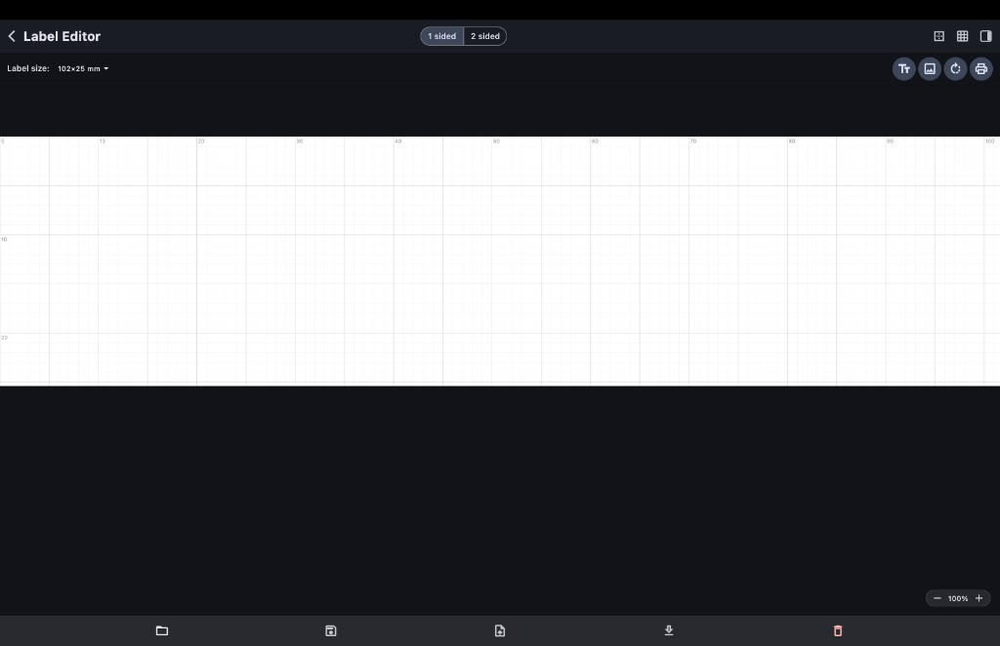

The white rectangle in the center is the **label canvas** — it represents the physical label. Rulers along the top and left show millimeters. A light grid helps with alignment. The dark area around the canvas is not part of the label. The header row contains the back arrow, **1 sided / 2 sided** toggle, and three icon buttons on the right. Below the header is the toolbar row with **Label size** on the left and four circular buttons on the right. The bottom bar holds five template management buttons.

### Header Controls

**Back arrow** — Return to Print labels.

**1 sided / 2 sided toggle** (center of header) — Choose single-sided or double-sided labels. When **2 sided** is selected, **Front** and **Back** tabs appear so you can design each side separately.

**Three icons on the right side of the header** (visible in Figure 4):

| Button | What it does |
|--------|-------------|
| **Square outline icon** | Opens/closes the **Label border** panel (configure an outline around the label). |
| **Grid icon** | Toggles the alignment grid on/off. |
| **Side-panel icon** | Toggles the **Available fields** panel on the right (see Figure 7). |

### Toolbar

**Figure 5** — Toolbar with label size and action buttons

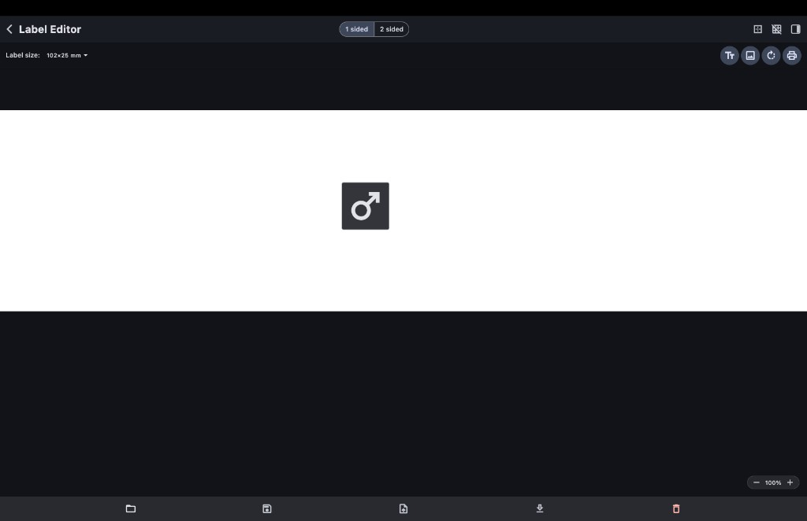

The toolbar row sits below the header. On the left is the **Label size** dropdown (here showing 102×25 mm). On the right are four circular buttons: **Tt** (add text), **image** (add image), **rotate arrow** (mirror for print), and **printer** (print preview).

**Label size** dropdown — Pick from preset label dimensions (mm) or enter custom sizes. Must match your physical label stock.

**Front / Back** — When **2 sided** is on, text labels here switch which side you are editing. A small rotate icon next to a side name means that side is mirrored 180° for printing.

**Four circular buttons:**

| Button | What it does |
|--------|-------------|
| **Tt** (text icon) | **Add text** — Places a new text box on the current side. Type plain text or database field tokens like `[avian.species]`. |
| **Image icon** | **Add image** — Opens a dialog to upload an image from your device or pick from saved images. |
| **Rotate arrow** | **Mirror for print** — Rotates the current side 180° in the printed output. For duplex alignment. Tap again to turn off. |
| **Printer icon** | **Print preview** — Opens a preview dialog showing how the label looks with real specimen data (see Figure 8). |

### Text Formatting Bar

When you select a text box on the canvas, a formatting bar appears below the toolbar.

**Figure 6** — Text formatting bar with `[avian.sex]-img` selected

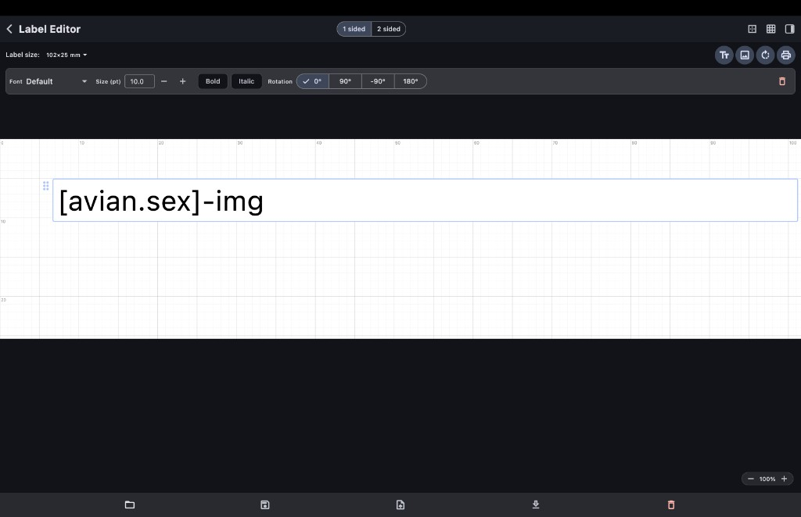

A text box on the canvas contains `[avian.sex]-img`. The formatting bar is visible above the canvas showing: **Font** dropdown, **Size (pt)** with **−** / **+** buttons, **Bold**, **Italic**, **Rotation** segment buttons (0°, 90°, -90°, 180°), and a red **trash** icon to delete the text box.

| Control | What it does |
|---------|-------------|
| **Font** dropdown | Choose font family. |
| **Size (pt)** field + **−** / **+** buttons | Set font size (4 pt minimum, 72 pt maximum). |
| **Bold** | Toggle bold. |
| **Italic** | Toggle italic. |
| **Rotation** (0° / 90° / -90° / 180°) | Rotate the text box. |
| **Trash icon** (red) | Delete this text box. |

**Note:** When the text box contains a sex icon token (`[taxon.sex]-img`), only the **trash** button appears — font/size/style controls are hidden because the element renders as an icon, not text.

### Canvas

The white label area (visible in Figures 4, 5, 9, 10) supports:
- **Drag** text boxes and images to reposition them.
- **Select** an image to see resize handles and a **Remove image** button.
- **Rulers** in mm along top and left edges.

### Available Fields Panel

Tap the **side-panel icon** in the header (Figure 4, rightmost icon) to open this panel on the right.

**Figure 7** — Available fields panel

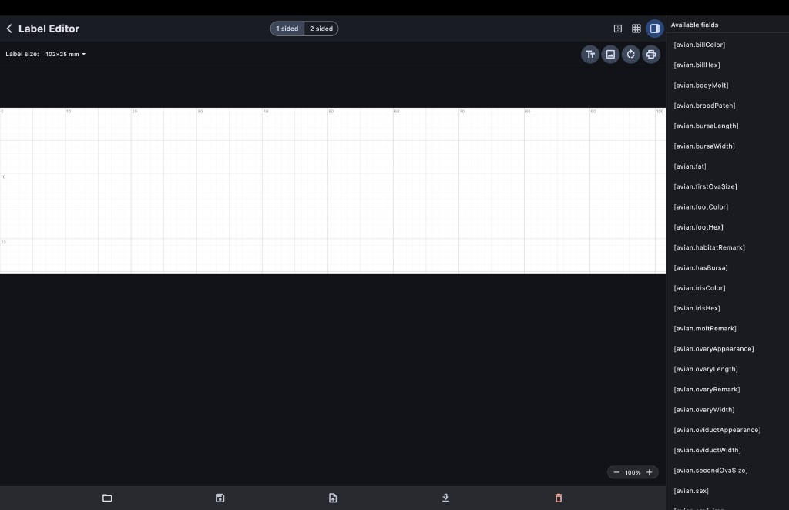

The **Available fields** panel appears on the right side of the editor. It lists every database field available as a placeholder token (e.g. `[avian.billColor]`, `[avian.sex]`, `[avian.fat]`, `[avian.irisColor]`, etc.). Use these as reference when typing tokens into text boxes on the canvas.

### Print Preview

Tap the **printer icon** in the toolbar (Figure 5) to open this modal.

**Figure 8** — Print preview dialog

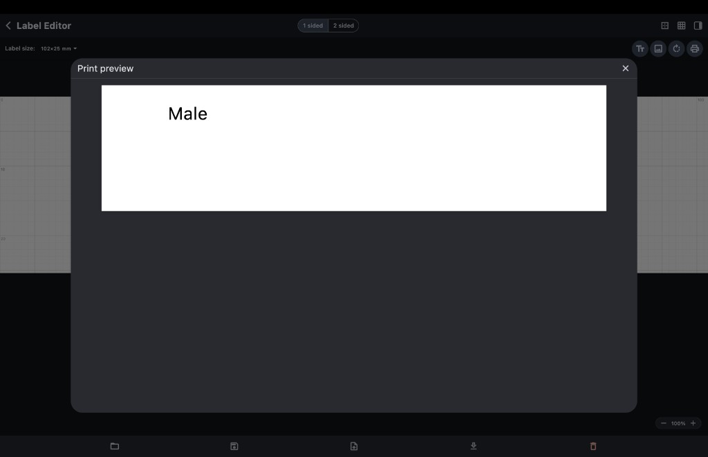

The **Print preview** dialog shows the label at full size with placeholder tokens replaced by real data from the first specimen in the project. Here, `[avian.sex]` resolved to the word **Male**. An **X** button in the top-right closes the dialog.

### Template Management (Bottom Bar)

The bottom bar (visible at the bottom of Figure 4) has five buttons for managing label templates. Templates store your entire label design (text, images, borders, sizes, 1/2-sided settings) as named files on the device.

| Button | What it does |
|--------|-------------|
| **Folder icon** | **Load template** — Opens a menu listing all saved template names. Tap one to load it into the editor and set it as the active template for printing. Grayed out if no templates are saved yet. |
| **Floppy disk icon** | **Save template** — Prompts for a template name and saves the current design. After saving, this template becomes the active one for printing. |
| **Upload icon** | **Export template** — Saves the current design as a JSON file to a location you choose. Use for backups or sharing with other devices. Does not remove anything from the app. |
| **Download icon** | **Import template** — Pick a JSON template file (e.g. one you exported). The app adds it to the saved templates list. If a template with the same name exists, you can choose **Replace**, **New name**, or **Cancel**. After import, the template loads in the editor and becomes active. |
| **Trash icon** (red) | **Delete saved template** — Only enabled when the current design matches a saved template name. Asks for confirmation, then permanently removes that template and resets the editor to a blank default. |

**Typical workflow:**

1. Design your label in the editor → **Save template** with a name → go back to **Print labels** → select specimens → **Print**.
2. Next time → open Label Editor → **Load template** → pick your saved name → make edits if needed → **Save template** again (same name to overwrite, or new name to keep both).
3. To backup or move templates between devices → **Export template** to a file → on the other device, **Import template** from that file.

### Zoom

Bottom-right corner of the canvas (visible in Figures 4, 5): **−** and **+** buttons with a percentage display (50% to 400%). Only affects on-screen editing zoom, not printed size.

### Example Layouts

**Figure 9** — Label with image and sex icon

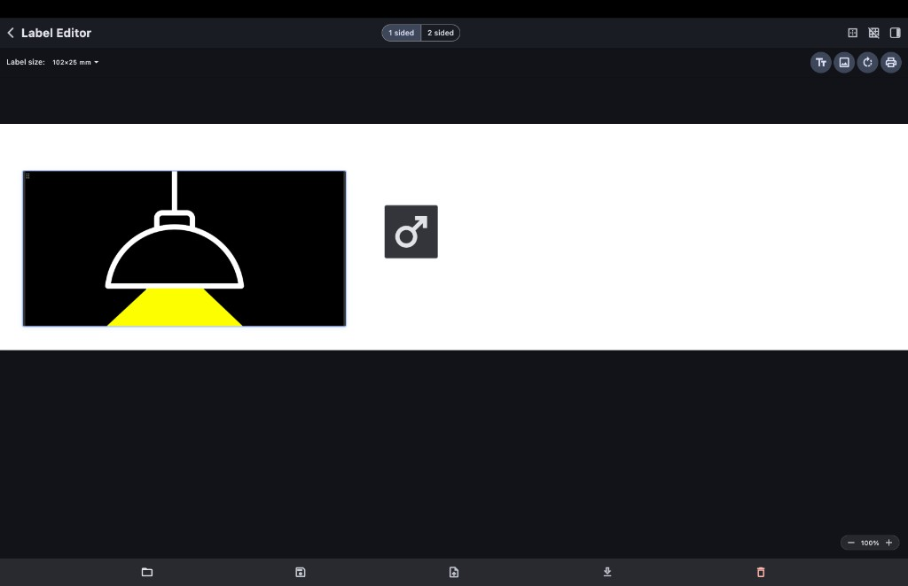

A label with two elements: an image (black rectangle with a lamp graphic) on the left, and a **male sex symbol icon** on the right. Both were placed using the **Add image** and **Add text** tools from the toolbar (Figure 5).

**Figure 10** — Alternate layout with elements repositioned

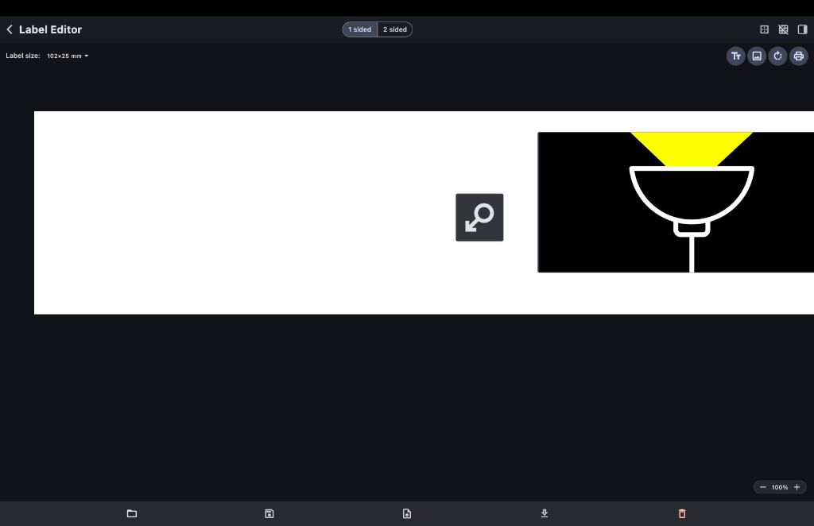

The same label elements rearranged — the sex symbol is in the center-left and the image is on the right. Elements can be freely dragged to any position on the canvas.

---

## Sex Field as Icon (-img)

For any field ending in `.sex` (e.g. `avian.sex`, `mammal.sex`), you can display a **sex symbol icon** on the label instead of the text word.

### How to Use

1. Add a text box on the canvas (**Tt** button, see Figure 5).
2. Type the field token with `-img` appended **after** the closing bracket:

```
[avian.sex]-img
```

or

```
[mammal.sex]-img
```

3. The text box turns into a **resizable icon** on the canvas (see Figure 12).

### Text vs Icon Comparison

**Without `-img`:** the field token `[avian.sex]` prints the stored text value.

**Figure 11** — Text box with `[avian.sex]` placeholder

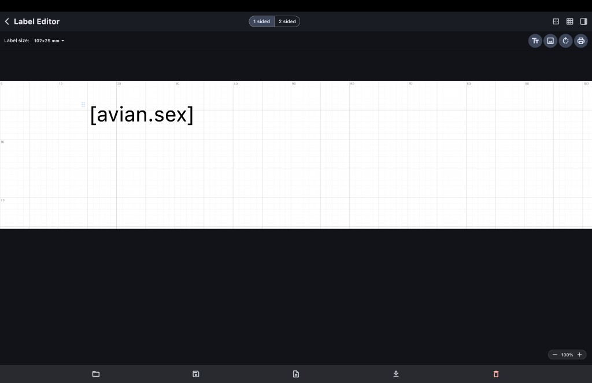

A text box on the canvas containing `[avian.sex]`. In print preview (Figure 8), this resolves to the word (e.g. "Male").

**With `-img`:** the field token `[avian.sex]-img` prints a sex symbol icon instead.

**Figure 12** — Sex icon rendered on canvas

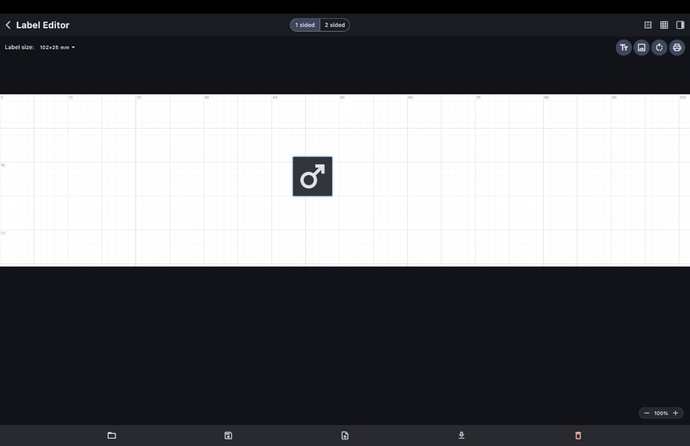

The result of typing `[avian.sex]-img`: a **male symbol (♂)** icon rendered on the canvas in place of text. The icon is resizable by dragging. Compare with the text version in Figure 11.

The formatting bar when editing this token is shown in Figure 6. The print preview comparison is shown in Figure 8.

### Rules

- `-img` goes **after** the closing bracket: `[avian.sex]-img` — correct.
- `-img` inside the brackets will **not** work: `[avian.sex-img]` — wrong.
- The text box must contain **only** the `[field]-img` token and nothing else on the line.
- The field name inside brackets must end with `.sex` (case-insensitive).
